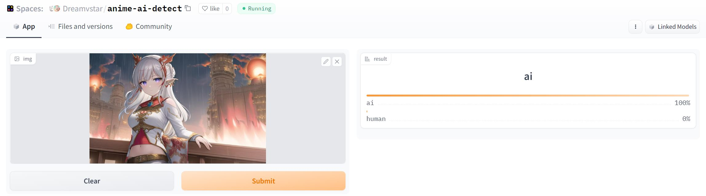
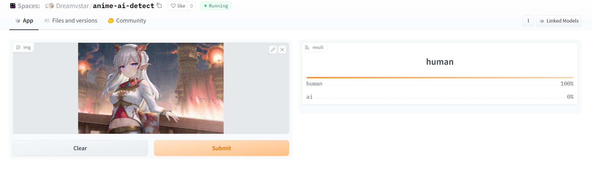

# 让AI认不出来AI画的图

# 人类无法察觉，但能让AI变傻

## 介绍
这是一个针对 [AI绘画识别器](https://huggingface.co/saltacc/anime-ai-detect) 
的对抗攻击实现，基于PGD和FGSM方法。

这个库可以让 saltacc/anime-ai-detect 的AI画图识别器失效，可以让人类画的图被认成AI画的，
AI画的被认成人类画的。而且这个方法生成的图像几乎不会被人类差距，***只需要像素值有1的改变***，就可以成功攻击。

## 效果展示
攻击前


攻击后


## 使用方式

安装依赖
```bash
pip install -r requirements.txt
```

攻击单张图像
```bash
python attack.py [图片路径] --eps 1 --step_size 0.135914 --test_atk
```

攻击多张图像
```bash
python attack.py [文件夹路径] --eps 1 --step_size 0.135914 --test_atk
```